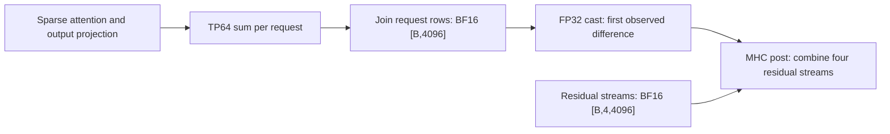

# GLM-5.3-Flash compact state and concurrent decode: draft

This change is not ready to merge. Single-request serving matches the measured
baseline, but two-request serving fails the unchanged exact correctness check.
There is no measured candidate throughput or accepted speedup.

## Branch and dependencies

The draft targets `glm-5.3-flash-port-clean`, the branch for PR #10 at
`a9f30889068935a88bc707fe853894bccfaa0299`. Its diff contains the optimization
and its prerequisite below. PR #10 carries the cleaned model port.

PR #10 does not contain the ordered MoE combine from PR #9. This draft carries
that prerequisite from `d9df12e668b1486e9bbae7e3fc952dd08a256c92`, preserving the
starting point used by the optimization campaign. Its kernel is unchanged.

The original campaign starts at the PR #9 merge,
`54d4b550ff97b2e906fa9446f707ebd4ba5369ff`. The draft preserves the latest
candidate's executable AST in the model, runner and worker, apart from the 12
error-message string changes already in PR #10. Comments and docstrings follow
the cleaned branch. Tests use that branch's renamed helper modules.

## Changes

- Allocate KDA state by admitted request count. Keep the padded slot layout,
  dtypes and scheduler cache specs. The measured configuration needs 8.50 MiB
  per rank for KDA state, down from 684.25 MiB.
- Keep per-request KDA arithmetic and state writes. Join output partials for one
  FP32 tensor-parallel reduction per KDA layer before the model-dtype cast.
- Preserve the tested singleton rounding with a minor-axis request layout for
  tensor-parallel sums and per-request MHC preparation and KDA input norms.
- Run sparse attention once per request with separate page tables and side-cache
  views. Write latent updates through the original three-dimensional bank.
- Join sparse-attention output rows in FP32 before restoring the public dtype.
  Apply the existing DSA input norm once per request, as in the KDA path.
- Give startup warmup separate temporary slots and pages. Refuse synthetic cache
  writes when a live request owns state. Concurrent prefill remains unsupported.

The native serving scope is TP64, EP16, DP1, LNC2, with parallel tracing disabled
and decode batches of one or two. Larger-batch component tests do not extend
that full-model scope.

## Validation and remaining failure

The current draft passed **372 selected tests** in 137.69 seconds on 2026-09-25.
These ran without devices in Docker image
`sha256:8b6d8ccd82c10303c7d2c85d76af025d16142912d8bac6642a10dadf8c776d5c`,
with `VLLM_NEURON_CPU_MODE=1`, `NKI_SIMULATOR=1`, `NKI_PRECISE_FP=1` and
`NEURON_PLATFORM_TARGET_OVERRIDE=trn2`. This is CPU and simulator evidence only.
The new `test_dsa_input_norm_rows.py` also passed all 28 cases in 6.55 seconds
in the same runtime. These check request order, cache routing, collector order
and rejection before cache writes. They do not prove compiled rounding behavior.

The selected pytest paths were:

```text
test/vllm_neuron/worker
test/vllm_neuron/model/glm5_next/test_request_keyed_state.py
test/vllm_neuron/model/glm5_next/test_kda_batched_decode.py
test/vllm_neuron/model/glm5_next/test_kda_input_norm_rows.py
test/vllm_neuron/model/glm5_next/test_dsa_concurrent_decode.py
test/vllm_neuron/model/glm5_next/test_mhc_concurrent_decode.py
test/vllm_neuron/model/glm5_next/test_tp_row_reduction.py
test/vllm_neuron/model/glm5_next/test_kda_layer.py
test/vllm_neuron/model/glm5_next/test_kda_request_operands.py
test/vllm_neuron/model/glm5_next/test_kda_reduction.py
test/vllm_neuron/model/glm5_next/test_mhc_composition.py
test/vllm_neuron/functional/moe/test_ordered_combine.py
```

Historical results below belong to the campaign source, not a new serving run
of this draft branch. The three baseline cohorts ran on 2026-09-21.
The runtime used PyTorch 2.11.0, vLLM 0.24.0,
libtorch-neuronx-lite 2.11.0.1.0.1284+f49d8626 and Neuron compiler
2.27.5334.0+f702b353 on Trainium2.

| Check | Result |
| --- | --- |
| Merged baseline, three timed cohorts | 3,840 output tokens / 408.712003 s = 9.395369 tokens/s |
| Earlier r12 candidate, selected Docker tests | 76 passed |
| Earlier r12 candidate, one-request serving | Exact baseline token IDs and log probabilities |
| Earlier r12 candidate, two-request serving | Failed: all 10 first-decode log-probability comparisons differ; four later token sequences diverge |
| Candidate throughput | Not run; correctness gate failed |
| FP32 join control | Attention combine repaired in all 256 cross-batch comparisons; FFN input normalization still differs |
| Current production candidate | 400 CPU/simulator tests passed; 384 native prefix cases preserve the partial repair |

The earlier observation replay preserves prior outputs and state. The first observed
difference is the FP32 attention input to MHC post in layer 3, the first sparse
attention layer. The saved BF16 attention values match between singleton and
paired execution. The singleton FP32 values retain extra bits; the paired values
are exact expansions of BF16. The other MHC operands match. This result covers
both requests, all 64 ranks and both repeats. It does not identify a compiler pass
or establish a production fix.



A standalone replay of the original MHC post method did not reproduce the saved
prefix outputs. It cannot establish a defect in that kernel. The next control
joined attention rows in FP32 and restored the public dtype afterward. After a
graph-checker repair, 384 native cases and an independent raw check confirmed
that singleton outputs and state remained exact. All 256 cross-batch comparisons
now match through MHC post and the raw FFN input. The normalized FFN input,
layer-4 output and state still differ.

The current production candidate retains that join and the DSA row norm. Its
native control removed both diagnostic norm overrides. All 384 cases preserved
the prior control's 12 taps, public output and seven complete state banks
exactly. An independent raw check confirmed that result. The first cross-batch
difference remains the normalized FFN input in all 256 comparisons. The
production change therefore preserves a partial repair; full-prefix correctness
remains open. Four full-serving candidates have failed. No fifth serving
attempt or candidate throughput measurement has run.

## Evidence retained outside this PR

The full diagnostic scripts, tensors, compiler artifacts and failed attempts stay
in the campaign workspace. They are not included in the release diff.

- Workspace: `/home/jinhun/vllm-neuron-campaigns/glm53-batched-kda-20260921/verification/batched-kda`
- Serving report: `e2e-report.json`, latest source `candidate-r12-row-norm`.
- Original model SHA256: `c4ae77a20392cc115f02ae42f74847b19cb9d0a76b490430df3a1a3b451d23eb`.
- R5 observation report SHA256: `a5c6c4d05277049b80781cf3f61fff387e43587e769a2a31fccc41049cce1fa3`.
- Independent R5 review SHA256: `e3ffdb419de3a49790a4cc53ea4ba69c48045ee6a8bc9e9e765002e43f5fe32b`.
- Frozen R5 reference SHA256: `8c8c2047365f1bf9fa13f8ba5155666d690ce61789455dcd19b5dcbc1bae2f90`.
- R6 observation report SHA256: `01402a0936b30b0e0fcaa1e6dd44fb0aab0ff72e1eb0dcc73510831f6b393c74`.
- Independent R6 raw review SHA256: `e458e478f5fd8fbc9ab134bd6045e037c7119149c878ceb476637ee580fc5347`.
- R6 FP32 bit audit SHA256: `cffaa53227d22cbf38b917bf316950142cd52409c7f500ec2696a5caf4e51e03`.
- R7b join report SHA256: `1a2e273e7d144d0d056cfc177c0393f238e11d44227f716b6b2c7c0d19f1c336`.
- Independent R7b raw review SHA256: `fead892d3f0dc09af5c72dbb47b7681f5af7bffdac5573c2a0f96d89e3bb4fca`.
- Production R8 report SHA256: `6844fac40d75fd4e6c94d39e3872dc45c6a81e732f39c72f655f21f60f3965ba`.
- Independent R8 raw review SHA256: `ad6f2a51d9dc8b8100fdaebd852563a0e1ed73c9c35643a950daee191ba3d00e`.
- Production R8 result review SHA256: `dc3afc96ece94d1eb9adef2c5d7555ec124f2966caa5112b326cef5c466db12e`.

Merge requires an exact full-model correctness pass, followed by the registered
throughput comparison. Neither requirement has been met.
